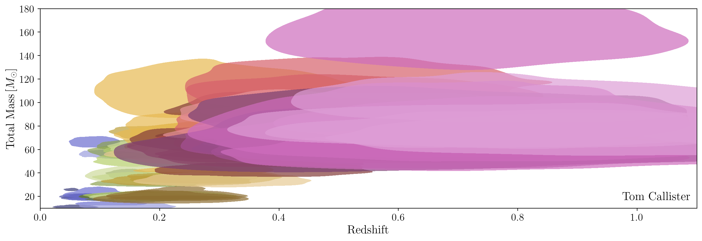

# mass-vs-redshift-pollock-plot

Plots illustrating the mass and redshift measurements of CBC detections through the GWTC-3 catalog.

### Plot 1: Scatter

Scatter plot of posterior mean total mass and redshift measurements (under a default, uninformative prior).
Colors are arbitrary, and the size of each dot scales with the event's estimated mass.

### Plot 2: An "honest" scatter

The same plot, but now with "blobs" that show the central 90% credible posterior bounds on each event's mass and redshift.

### Plot 3: An "honest" scatter, annotated

As above, but now annotated to emphasize, for pedagogical purposes, that these measurements *do not* establish a correlation between mass and redshift.
Instead, the absence of measurements in the upper left corner is due to the relative rarity of high mass black holes and the small time-volume probed in the nearby Universe.
And the absence of events in the lower right corner is due to search selection effects.

